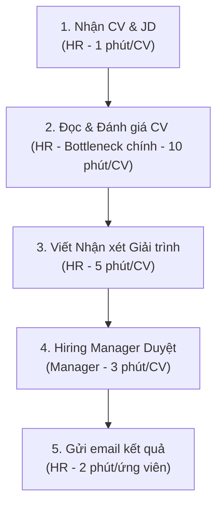
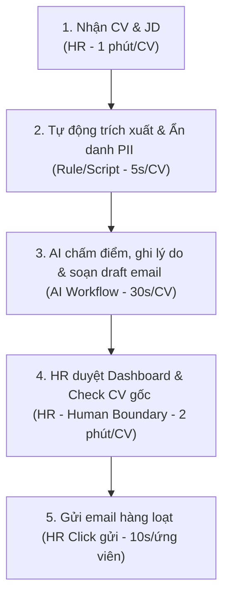

# Group Report — Day 02

## Thành viên nhóm

| STT | Họ và tên        | Mã học viên | Vai trò trong nhóm |
| --- | ---------------- | ----------- | ------------------ |
| 1   | Nguyễn Chí Hướng | 2A202601203 | Thành viên         |
| 2   | Nguyễn Tiến Đạt  | 2A202601387 | Thành viên         |
| 3   | Ngô Tuấn Hưng    | 2A202601409 | Thành viên         |
| 4   | Trần Xuân Lộc    | 2A202601671 | Thành viên         |
| 5   | Lại Duy Đông     | 2A202601913 | Trưởng nhóm        |

---

## Candidate Problems

|   # | Người đưa ra     | Candidate problem                                                                        | Người gặp vấn đề                         | Điểm nghẽn                                                                                                                            | Cảm nhận nhanh                                                                                                  |
| --: | ---------------- | ---------------------------------------------------------------------------------------- | ---------------------------------------- | ------------------------------------------------------------------------------------------------------------------------------------- | --------------------------------------------------------------------------------------------------------------- |
|   1 | Nguyễn Tiến Đạt  | Trích xuất ý chính từ tài liệu PDF dài                                                   | Sinh viên, nghiên cứu sinh               | Đọc lướt tìm ý bằng mắt và copy-paste tốn nhiều thời gian                                                                             | Tiết kiệm 70% thời gian; hợp dùng AI Workflow                                                                   |
|   2 | Nguyễn Tiến Đạt  | Sàng lọc CV ứng viên vòng đầu (Screening)                                                | Nhân viên Tuyển dụng (HR)                | Mở từng file CV, đọc dò mắt tìm kỹ năng theo JD                                                                                       | Tiết kiệm hàng chục giờ việc chân tay; hợp AI Workflow                                                          |
|   3 | Nguyễn Tiến Đạt  | Gỡ băng video & viết lại Content đa nền tảng                                             | Content Creator, Marketing               | Nghe, gỡ băng thủ công (transcript) video dài                                                                                         | Rút từ 4 tiếng xuống 30 phút/video; hợp AI Workflow                                                             |
|   4 | Ngô Tuấn Hưng    | Viết tài liệu đặc tả luồng module để cải tiến (System Logic Mapping)                     | Developer / System Architect / Tech Lead | Đọc code, trace luồng thủ công và vẽ sơ đồ luồng                                                                                      | AI vẽ Mermaid + viết đặc tả ban đầu, Developer review và chỉnh sửa                                              |
|   5 | Ngô Tuấn Hưng    | Tìm bug và debug trong code (pytest/runtime error debugging)                             | Học viên / Python Developer              | Đọc traceback dài và tự suy luận lỗi logic                                                                                            | AI định vị, giải thích nguyên nhân; Developer tự sửa code                                                       |
|   6 | Ngô Tuấn Hưng    | Giải quyết Git conflict khi merge code                                                   | Thành viên nhóm phát triển / DevOps      | So sánh code thủ công giữa hai nhánh, trao đổi với đồng đội                                                                           | AI gợi ý phương án merge tối ưu, Developer phê duyệt                                                            |
|   7 | Trần Xuân Lộc    | Xử lý bug/ticket lặp lại cùng pattern                                                    | Developer, QA                            | Mất 2–4 giờ/tuần tìm codebase và git log cũ                                                                                           | Pain lặp lại hàng tuần; Workflow rõ ràng; AI có tiềm năng gợi ý solution                                        |
|   8 | Trần Xuân Lộc    | Onboarding Developer mới                                                                 | Developer mới, Mentor                    | Mất 2–3 giờ/ngày trong tuần đầu để giải thích quy trình và code                                                                       | Giảm tải cho Mentor; phù hợp AI Agent Chatbot tra cứu tài liệu và code                                          |
|   9 | Trần Xuân Lộc    | Tổng hợp thông tin viết báo cáo tuần                                                     | Developer, Team Lead                     | Gom dữ liệu từ Jira, Slack, Docs mất 60–90 phút/tuần                                                                                  | Quy trình lặp lại; dễ tự động hóa bằng AI và tích hợp dữ liệu                                                   |
|  10 | Lại Duy Đông     | Sàng lọc & xếp hạng CV tự động                                                           | Recruiter (HR Department)                | Đọc, đối chiếu CV với JD và chấm điểm thủ công (~10 phút/CV)                                                                          | ROI cao; phù hợp Agent AI; cần bảo mật dữ liệu cá nhân (PII)                                                    |
|  11 | Lại Duy Đông     | Mock data tự động cho Frontend                                                           | Frontend Developer                       | Phải chờ Backend cung cấp API hoặc JSON mẫu để kiểm thử UI                                                                            | Giảm phụ thuộc giữa Frontend và Backend; AI sinh JSON hiệu quả                                                  |
|  12 | Lại Duy Đông     | Giải đáp câu hỏi tự động trên Discord                                                    | Trợ giảng (TA), Học viên                 | Tra cứu tài liệu và trả lời các câu hỏi lặp lại                                                                                       | RAG Bot phù hợp; giảm tải cho TA; tần suất sử dụng cao                                                          |
|  13 | Nguyễn Chí Hướng | Tự động thiết lập môi trường phát triển cho đồ án (Java, Python, Node.js, SQL Server...) | Sinh viên CNTT                           | Mỗi project mới phải cài đặt IDE, SDK, database, package và cấu hình môi trường; mất 30–90 phút, dễ lỗi version hoặc thiếu dependency | Tần suất lặp lại cao; tiết kiệm nhiều thời gian setup; phù hợp AI Workflow/AI Agent tự động cấu hình môi trường |
|  14 | Nguyễn Chí Hướng | Quản lý và nhắc nhở deadline học tập thông minh                                          | Sinh viên                                | Phải kiểm tra Messenger, LMS, Email và nhiều nhóm học để biết deadline; dễ bỏ sót hoặc cập nhật muộn                                  | Giá trị sử dụng hằng ngày; AI có thể tổng hợp và nhắc việc tự động từ nhiều nguồn; giảm nguy cơ quên deadline   |
|  15 | Nguyễn Chí Hướng | Trợ lý AI tổng hợp và tìm kiếm tài liệu học tập đa nguồn                                 | Sinh viên                                | Một chủ đề phải tìm trên YouTube, GitHub, Documentation, ChatGPT và Google; thông tin phân tán, khó chọn lọc                          | Phù hợp xây dựng AI Workflow/RAG; giảm thời gian tìm kiếm, tổng hợp tài liệu và tăng hiệu quả học tập           |

---

## Clustering

| Cluster                                              | Candidates included                                                                                                                                                                                                                                                                            | Pattern chung                                                                                  | Ghi chú                                                                        |
| ---------------------------------------------------- | ---------------------------------------------------------------------------------------------------------------------------------------------------------------------------------------------------------------------------------------------------------------------------------------------- | ---------------------------------------------------------------------------------------------- | ------------------------------------------------------------------------------ |
| **A. HR & Recruitment Automation**                   | **#2** Sàng lọc CV ứng viên vòng đầu (Nguyễn Tiến Đạt), **#10** Sàng lọc & xếp hạng CV tự động (Lại Duy Đông)                                                                                                                                                                                  | Tự động hóa quy trình tuyển dụng bằng AI (đọc, phân tích, đánh giá và xếp hạng CV theo JD)     | Hai candidate gần như cùng một bài toán, có thể gộp thành một hướng phát triển |
| **B. Developer Productivity & Software Engineering** | **#4** System Logic Mapping, **#5** Debug code, **#6** Git Conflict Resolution (Ngô Tuấn Hưng), **#7** Xử lý bug lặp lại, **#8** Onboarding Developer, **#9** Báo cáo tuần (Trần Xuân Lộc), **#11** Mock Data Frontend (Lại Duy Đông), **#13** Tự động thiết lập môi trường phát triển (Hướng) | Giảm thời gian cho các công việc kỹ thuật lặp lại trong SDLC bằng AI Workflow/Agent            | Đây là cluster lớn nhất                                                        |
| **C. Learning & Education Assistant**                | **#1** Trích xuất ý chính PDF, **#12** Discord Q&A Bot, **#14** Quản lý deadline học tập, **#15** Tổng hợp tài liệu học tập đa nguồn                                                                                                                                                           | AI hỗ trợ học tập: tổng hợp kiến thức, tra cứu, quản lý học tập và trả lời câu hỏi             | Có thể phát triển thành hệ sinh thái AI Assistant                              |
| **D. Content & Knowledge Automation**                | **#3** Gỡ băng video & viết Content đa nền tảng                                                                                                                                                                                                                                                | Chuyển đổi và tái sử dụng nội dung bằng AI (Speech-to-Text, Summarization, Content Generation) | Hiện chỉ có một candidate                                                      |

---

## Shortlist

| Candidate                                                          | Vì sao vào shortlist                                                                                                                                                               | Rủi ro / điều chưa rõ                                                  |
| ------------------------------------------------------------------ | ---------------------------------------------------------------------------------------------------------------------------------------------------------------------------------- | ---------------------------------------------------------------------- |
| **#10 – Sàng lọc & xếp hạng CV tự động**                           | Workflow tuyển dụng rõ ràng (JD → đọc CV → chấm điểm → xếp hạng → HR review). Actor cụ thể. Bottleneck dễ đo. Dễ so sánh Rule-based, AI Workflow và AI Agent. Giá trị kinh tế cao. | Cần dữ liệu CV/JD thực tế; yêu cầu bảo mật PII; AI có thể tạo bias     |
| **#13 – Tự động thiết lập môi trường phát triển**                  | Workflow rõ, bottleneck phổ biến, phù hợp AI Agent hỗ trợ cài đặt và xử lý lỗi                                                                                                     | Khó hỗ trợ mọi hệ điều hành và công nghệ                               |
| **#15 – Trợ lý AI tổng hợp và tìm kiếm tài liệu học tập đa nguồn** | Workflow rõ, dễ mở rộng với RAG và AI Workflow                                                                                                                                     | Chất lượng phụ thuộc nguồn dữ liệu; tích hợp nhiều nguồn mất thời gian |

---

## Candidate Scoring

| Candidate                                                          | Actor rõ | Workflow rõ | Pain có evidence | Impact đo được | Làm trong lab | So sánh R/W/A được | Nhóm hiểu domain |   Tổng |
| ------------------------------------------------------------------ | -------: | ----------: | ---------------: | -------------: | ------------: | -----------------: | ---------------: | -----: |
| **#10 – Sàng lọc & xếp hạng CV tự động**                           |        5 |           5 |                5 |              5 |             4 |                  5 |                4 | **33** |
| **#13 – Tự động thiết lập môi trường phát triển**                  |        5 |           5 |                5 |              4 |             4 |                  5 |                5 | **33** |
| **#15 – Trợ lý AI tổng hợp và tìm kiếm tài liệu học tập đa nguồn** |        5 |           4 |                4 |              4 |             5 |                  5 |                5 | **32** |

---

# Candidate nhóm chọn

## #10 – Sàng lọc & xếp hạng CV tự động (AI Agent hỗ trợ Recruiter)

### Problem

Recruiter phải đọc và đánh giá thủ công hàng trăm CV cho mỗi vị trí tuyển dụng, mất nhiều thời gian, dễ thiếu nhất quán và phản hồi ứng viên chậm.

### Actor

Recruiter (Bộ phận Tuyển dụng của doanh nghiệp).

### Giải pháp

Xây dựng AI Agent tự động đọc CV (PDF/DOCX/ảnh), trích xuất thông tin, đối chiếu với Job Description (JD), chấm điểm, giải thích lý do đánh giá, xếp hạng ứng viên và tạo danh sách Shortlist để Recruiter kiểm duyệt (Human-in-the-Loop).

---

# Vì sao chọn

- Đây là bài toán thực tế mà nhiều doanh nghiệp gặp phải khi tuyển dụng số lượng lớn.
- Actor (Recruiter) và workflow tuyển dụng được xác định rõ ràng.
- Bottleneck tập trung ở bước đọc CV và đối chiếu với JD, rất phù hợp để ứng dụng AI.
- Hiệu quả có thể đo lường bằng thời gian xử lý, tỷ lệ đồng thuận giữa AI và Recruiter và thời gian phản hồi ứng viên.
- Có thể so sánh rõ giữa Rule-based (lọc theo từ khóa), AI Workflow và AI Agent.
- Phạm vi phù hợp với thời gian thực hiện của môn học và có thể xây dựng prototype để demo.
- Đề tài có giá trị ứng dụng thực tế, ROI cao và có tiềm năng mở rộng trong doanh nghiệp.

---

# Vì sao không chọn các candidate còn lại

- **#13 – Tự động thiết lập môi trường phát triển:** phù hợp với sinh viên CNTT nhưng phụ thuộc nhiều vào hệ điều hành, ngôn ngữ lập trình và công cụ, khiến phạm vi triển khai khá rộng trong thời gian của môn học.
- **#15 – Trợ lý AI tổng hợp và tìm kiếm tài liệu học tập:** dễ triển khai nhưng đã có nhiều giải pháp tương tự trên thị trường, tính khác biệt chưa cao và khó chứng minh hiệu quả định lượng hơn so với bài toán tuyển dụng.
- Các candidate khác trong nhóm chủ yếu giải quyết các nhu cầu nội bộ hoặc có phạm vi hẹp, trong khi bài toán sàng lọc CV có giá trị kinh doanh rõ ràng, quy trình chuẩn và dễ chứng minh hiệu quả của AI Agent.

---

# Nếu có disagreement, nhóm xử lý thế nào

Ban đầu nhóm có hai candidate được đánh giá cao là:

- **#10 – Sàng lọc & xếp hạng CV tự động**
- **#13 – Tự động thiết lập môi trường phát triển**

Nhóm tiến hành thảo luận dựa trên các tiêu chí đã thống nhất ở bước **3.4** gồm:

- Độ rõ của actor
- Workflow
- Bottleneck
- Khả năng đo lường impact
- Mức độ phù hợp với AI Agent
- Phạm vi thực hiện trong lab

Sau khi chấm điểm và trao đổi, nhóm thống nhất chọn **#10** vì có giá trị thực tiễn cao hơn, workflow chuẩn, dễ xây dựng demo và dễ đánh giá hiệu quả bằng các chỉ số cụ thể.

Quyết định cuối cùng được thông qua theo sự đồng thuận của toàn bộ thành viên trong nhóm.

---

## Phase 4 — Quick Validation + Research giải pháp

### Bước 4.1 — Quick validation

Nhóm tiến hành kiểm chứng nhanh giả định bằng hai hình thức: phỏng vấn sâu một số nhà tuyển dụng (HR/Recruiter) và làm khảo sát nhỏ trong cộng đồng tuyển dụng/lập trình.

| Nguồn               |           Số người / số mẫu | Tín hiệu xác nhận (Pain is real)                                                                                                                                                                                                                        | Tín hiệu phản bác / Lưu ý                                                                                                                                                                                 | Nhóm sửa problem thế nào                                                                                                                                                                                                                          |
| ------------------- | --------------------------: | ------------------------------------------------------------------------------------------------------------------------------------------------------------------------------------------------------------------------------------------------------- | --------------------------------------------------------------------------------------------------------------------------------------------------------------------------------------------------------- | ------------------------------------------------------------------------------------------------------------------------------------------------------------------------------------------------------------------------------------------------- |
| **Quick Interview** | 3 Recruiter chuyên tuyển IT | _ 3/3 người đều xác nhận việc đọc CV, đối chiếu với JD và viết ghi chú lý do đạt/loại thủ công là bước mất thời gian nhất (trung bình 10 phút/CV)._ Khi số lượng hồ sơ lớn (>50 CV/vị trí), họ bị mệt mỏi dẫn đến bỏ sót hoặc đánh giá thiếu nhất quán. | _ 1 Recruiter lưu ý rằng AI có thể không hiểu được những dự án phi kỹ thuật hoặc các thuật ngữ viết tắt tự chế của ứng viên._ Lo ngại cao về việc lộ thông tin cá nhân (PII) của ứng viên khi đưa lên AI. | _ Không xây dựng giải pháp tự động gửi kết quả từ chối/nhận trực tiếp._ Thêm bước tiền xử lý để ẩn danh thông tin PII (tên, liên hệ, trường học...) trước khi gửi qua LLM.\* AI chỉ đề xuất điểm số và lý do (rationale), HR là người duyệt cuối. |
| **Mini Poll**       |  8 Lead/Mentor duyệt CV Dev | _ 7/8 người đồng ý việc chấm điểm CV tốn thời gian._ Điểm đau nhất: Phải viết lý do chi tiết vì sao duyệt hoặc từ chối để giải trình cho Manager hoặc phản hồi cho ứng viên (mức độ cần giải quyết: 4.6/5).                                             | \* Nhiều trường hợp CV viết quá ngắn hoặc quá hoa mỹ khiến AI đánh giá sai lệch so với năng lực thực tế.                                                                                                  | \* Thiết kế hệ thống chấm điểm dựa trên bằng chứng (evidence-based scoring) lấy từ nội dung CV chứ không chỉ dựa vào tần suất từ khóa.                                                                                                            |

> [!NOTE]
> **Insight quan trọng sau validation:**
> Pain thật sự của nhà tuyển dụng không chỉ đơn thuần là phân loại "Đạt/Không Đạt", mà là việc **đọc hiểu kinh nghiệm thực tế để đối chiếu với yêu cầu dự án** và **viết giải trình/nhận xét cho từng ứng viên**. Giải pháp bắt buộc phải có sự kiểm soát của con người (Human-in-the-Loop) và cơ chế bảo vệ thông tin cá nhân.

---

### Bước 4.2 — Research giải pháp đã có

Nhóm thực hiện nghiên cứu 3 giải pháp/xu hướng hiện tại trên thị trường để tìm ra khoảng trống công nghệ và rút ra bài học thực tế.

| Nguồn / tool / case                       | Link                                                                                                  | Họ giải quyết phần nào?                                                                             | Điểm mạnh                                                                                        | Khoảng trống / rủi ro                                                                                                                                      | Bài học cho nhóm                                                                                                                                                       |
| ----------------------------------------- | ----------------------------------------------------------------------------------------------------- | --------------------------------------------------------------------------------------------------- | ------------------------------------------------------------------------------------------------ | ---------------------------------------------------------------------------------------------------------------------------------------------------------- | ---------------------------------------------------------------------------------------------------------------------------------------------------------------------- |
| **Base ATS / Greenhouse**                 | [Base ATS](https://base.vn/ats)                                                                       | Quản lý phễu ứng viên, phân tích cú pháp CV (CV parsing) cơ bản và lọc từ khóa (keywords matching). | Quản lý quy trình (workflow) khoa học, bảo mật dữ liệu tốt, giao diện quản lý CV tập trung.      | Chỉ lọc từ khóa thô sơ, dễ bị ứng viên qua mặt bằng cách nhồi nhét từ khóa (keyword stuffing) hoặc bỏ sót ứng viên viết CV phi chuẩn.                      | Dùng ATS làm nơi lưu trữ và điều phối quy trình, nhưng cần một lớp AI thông minh hơn để đọc hiểu ngữ cảnh CV.                                                          |
| **OpenAI Custom GPTs (Resume Screeners)** | [OpenAI GPTs](https://openai.com/blog/introducing-gpts)                                               | Trích xuất thông tin CV và chấm điểm tương thích với JD theo prompt định sẵn.                       | Dễ cấu hình, xử lý ngôn ngữ tự nhiên tốt, hiểu được các ngữ cảnh phức tạp hơn từ khóa đơn thuần. | Gặp rủi ro cực lớn về bảo mật dữ liệu PII của ứng viên; có thể bị ảo giác (hallucination) bịa đặt thông tin; chi phí API cao nếu xử lý file lớn trực tiếp. | Phải thiết kế một module ẩn danh dữ liệu (Data Anonymizer) cục bộ trước khi gửi thông tin lên LLM API để đảm bảo an toàn thông tin.                                    |
| **Vụ việc AI tuyển dụng của Amazon**      | [Reuters Case Study](https://www.reuters.com/article/us-amazon-jobs-automation-insight-idUSKCN1MK08G) | Chấm điểm tự động dựa trên dữ liệu lịch sử tuyển dụng 10 năm của doanh nghiệp.                      | Tự động hóa hoàn toàn quy trình lọc hồ sơ quy mô lớn.                                            | Mô hình bị thiên vị giới tính (bias) do học từ dữ liệu lịch sử chủ yếu là nam giới trong ngành công nghệ.                                                  | _ Tuyệt đối không để AI tự học không giám sát từ dữ liệu cũ có thiên vị._ Cần chấm điểm dựa trên bộ tiêu chí khách quan cố định được thiết lập trực tiếp từ JD cụ thể. |

> [!IMPORTANT]
> **Research Takeaway:**
> Để giải quyết triệt để bài toán này một cách an toàn, nhóm không nên tin tưởng hoàn toàn vào một "Black-box AI" tự chấm điểm và tự quyết định. Phương án tối ưu là xây dựng một **Workflow có AI hỗ trợ**:
>
> 1. Trích xuất thông tin CV và ẩn danh PII.
> 2. Dùng AI chấm điểm theo các tiêu chí (Rubric) cụ thể và đưa ra lý luận (Reasoning) làm bằng chứng.
> 3. Recruiter kiểm tra lại điểm số, lý do của AI và đưa ra quyết định đi tiếp.

---

## Phase 5 — Workflow + Problem Statement

### Bước 5.1 — Current workflow bản nhóm

Quy trình sàng lọc CV thủ công hiện tại của nhóm tuyển dụng được mô tả chi tiết dưới đây:



| Bước                            | Actor          | Input                                                       | Output                                                         | Thời gian/tần suất                               | Ghi chú & Handoff                                                                                                                                        |
| ------------------------------- | -------------- | ----------------------------------------------------------- | -------------------------------------------------------------- | ------------------------------------------------ | -------------------------------------------------------------------------------------------------------------------------------------------------------- |
| **1. Nhận CV & JD**             | Recruiter (HR) | CV (PDF/Word) từ Linkedin, TopCV... + JD từ Hiring Manager. | Thư mục lưu trữ CV thô theo từng vị trí tuyển dụng.            | 1 phút/CV (Hằng ngày khi có ứng viên ứng tuyển). | HR tải CV về máy hoặc đưa vào thư mục lưu trữ chung. Không có handoff.                                                                                   |
| **2. Đọc & Đánh giá CV**        | Recruiter (HR) | JD chi tiết + Từng CV ứng viên.                             | Bảng đánh giá sơ bộ điểm mạnh/yếu của ứng viên.                | **7-10 phút/CV** (2-3 lần/tuần theo đợt tuyển).  | **Bottleneck chính:** HR phải đọc kỹ để tìm kiếm kinh nghiệm thực tế tương thích, dễ mệt mỏi dẫn đến chấm điểm chủ quan hoặc bỏ sót khi có quá nhiều CV. |
| **3. Viết Nhận xét Giải trình** | Recruiter (HR) | Kết quả đánh giá thô của CV ở Bước 2.                       | File Excel tổng hợp ứng viên kèm cột lý do chọn/loại chi tiết. | **3-5 phút/CV** (Hàng tuần).                     | HR phải tự viết các câu giải trình ngắn gọn nhưng thuyết phục để chuyển giao (handoff) sang Hiring Manager duyệt tiếp.                                   |
| **4. Hiring Manager Duyệt**     | Hiring Manager | File Excel tổng hợp nhận xét + Link CV gốc từ HR.           | Danh sách ứng viên chốt lịch phỏng vấn (Shortlist).            | 3 phút/CV (1 lần/tuần).                          | Handoff ngược lại cho Recruiter để liên hệ ứng viên. Nếu nhận xét của HR quá sơ sài, Manager buộc phải đọc lại từ đầu.                                   |
| **5. Gửi email kết quả**        | Recruiter (HR) | Quyết định cuối của Hiring Manager.                         | Email mời phỏng vấn hoặc email cảm ơn/từ chối đã gửi.          | 2 phút/ứng viên (Hàng tuần).                     | HR thường dùng template chung. Viết email từ chối có tâm (nêu lý do trượt cụ thể) rất tốn công nên thường bị bỏ qua (ghosting ứng viên).                 |

- **Bottleneck chính:** Bước **Đọc & Đánh giá CV** (Bước 2) và **Viết Nhận xét Giải trình** (Bước 3). Tổng thời gian tốn từ 10 - 15 phút cho mỗi CV, đòi hỏi HR phải liên tục chuyển đổi ngữ cảnh tư duy để so khớp kỹ thuật giữa JD và CV, gây quá tải khi có hàng trăm hồ sơ nộp về cùng lúc.

---

### Bước 5.2 — Future workflow bản nhóm

Quy trình tương lai ứng dụng AI và Tự động hóa để giải quyết các điểm nghẽn nhưng vẫn giữ ranh giới kiểm soát chất lượng chặt chẽ:



#### Phân định vai trò trong quy trình mới:

1. **Rule (Quy tắc/Tự động hóa thô)**:
   - Trích xuất dữ liệu văn bản từ file PDF/Word của CV.
   - Chạy script ẩn danh dữ liệu nhạy cảm (PII Anonymizer) để loại bỏ: Tên, Email, Số điện thoại, Link cá nhân, Địa chỉ cụ thể.
2. **AI/Workflow hỗ trợ (Trí tuệ nhân tạo điều phối)**:
   - LLM đọc thông tin CV đã ẩn danh và bản JD để chấm điểm theo bộ tiêu chí (Rubric) có sẵn (Kinh nghiệm, Kỹ năng cứng, Dự án thực tế).
   - LLM sinh ra văn bản lập luận (Reasoning) giải thích rõ ràng tại sao cho điểm số đó (trích dẫn bằng chứng từ CV).
   - LLM soạn thảo sẵn (draft) email mời phỏng vấn hoặc email từ chối mang tính xây dựng dựa trên điểm mạnh/yếu của ứng viên đó.
3. **Con người kiểm soát (Human Boundary)**:
   - Recruiter (HR) xem toàn bộ thông tin trên một bảng Dashboard tập trung (gồm CV gốc, điểm số AI gợi ý, phần lý do và dự thảo email).
   - Recruiter đưa ra quyết định duyệt/bác bỏ đánh giá của AI (Go/No-go). AI tuyệt đối **không được tự ý gửi email** ra ngoài hoặc tự ý loại hồ sơ của ứng viên.
4. **Phương án quay về (Fallback)**:
   - Nếu hệ thống AI bị lỗi kết nối hoặc LLM đưa ra đánh giá không chính xác (hallucination, chấm sai lệch lớn), Recruiter sẽ tắt chế độ hỗ trợ AI và tự đọc CV rồi chấm điểm thủ công như quy trình cũ.

#### Bảng so sánh hiệu quả (Before/After Impact):

| Metric                   |                           Trước |                       Sau kỳ vọng | Ghi chú                                                                                           |
| ------------------------ | ------------------------------: | --------------------------------: | ------------------------------------------------------------------------------------------------- |
| **Số bước**              |                          5 bước |                            5 bước | Số bước giữ nguyên để đảm bảo quy trình kiểm soát chất lượng tuyển dụng chặt chẽ.                 |
| **Tổng thời gian xử lý** |                     ~18 phút/CV |                    **~3 phút/CV** | Tiết kiệm đến**83%** thời gian nhờ tự động hóa việc đọc sơ khớp và soạn thảo văn bản.             |
| **Số bước làm thủ công** |                        5/5 bước |                      **2/5 bước** | Chỉ còn bước tiếp nhận hồ sơ ban đầu và bước HR trực tiếp duyệt/chốt kết quả trên Dashboard.      |
| **Bottleneck chính**     | Đọc đánh giá CV & Viết nhận xét |      HR kiểm duyệt trên Dashboard | Bottleneck mới nhẹ nhàng hơn rất nhiều và đóng vai trò làm chốt chặn kiểm soát chất lượng (HITL). |
| **Risk mới phát sinh**   |     Không có (chỉ tốn nhân lực) | AI ảo giác, thiên vị ẩn do prompt | Khắc phục bằng cách ẩn danh PII trước khi gửi LLM và bắt buộc Recruiter phải phê duyệt.           |

---

### Bước 5.3 — Problem Statement v0

| Field              | Nội dung                                                                                                                                                                                                                                                                                       |
| ------------------ | ---------------------------------------------------------------------------------------------------------------------------------------------------------------------------------------------------------------------------------------------------------------------------------------------- |
| **Actor**          | Recruiter (HR) chịu trách nhiệm sàng lọc hồ sơ ứng viên bước đầu trong các chiến dịch tuyển dụng.                                                                                                                                                                                              |
| **Workflow**       | Nhận CV & JD → Đọc & Đối chiếu CV với JD → Viết nhận xét giải trình ưu/nhược điểm → Hiring Manager duyệt shortlist → HR liên hệ gửi email kết quả.                                                                                                                                             |
| **Bottleneck**     | Bước đọc CV đối chiếu yêu cầu kỹ thuật (mất 7-10 phút/CV) và viết nhận xét chi tiết để thuyết phục Manager (mất 3-5 phút/CV) hoàn toàn thủ công.                                                                                                                                               |
| **Impact**         | Tốn khoảng 15-20 phút cho mỗi hồ sơ. Với đợt tuyển dụng trung bình 100 CV, HR mất đến 25-30 giờ làm việc; chậm trễ liên hệ làm mất ứng viên giỏi vào tay đối thủ; HR không đủ thời gian viết mail phản hồi có tâm nên thường "ghost" ứng viên bị loại, làm giảm uy tín thương hiệu tuyển dụng. |
| **Success Metric** | Giảm tổng thời gian xử lý trung bình từ 18 phút/CV xuống**dưới 3 phút/CV** (giảm 85%); 100% ứng viên không đạt nhận được email từ chối có kèm nhận xét mang tính xây dựng chi tiết trong vòng 3 ngày kể từ khi đóng cổng lọc.                                                                  |
| **Boundary**       | AI không được tự động ra quyết định loại/nhận ứng viên; không tự động gửi email cho ứng viên; dữ liệu truyền lên LLM API phải được ẩn danh hoàn toàn (loại bỏ Họ tên, Email, SĐT, Địa chỉ); AI chỉ được sử dụng thông tin hiện hữu trong CV, không tự suy diễn kinh nghiệm.                    |

> [!TIP]
> **Prompt phản biện đề xuất cho nhóm sử dụng:**
>
> ```text
> Đây là Problem Statement v0 của nhóm tôi:
> - Actor: Recruiter (HR) lọc hồ sơ tuyển dụng.
> - Workflow: Nhận CV&JD -> Đọc đánh giá -> Viết nhận xét -> Manager duyệt -> Gửi email.
> - Bottleneck: Đọc đối chiếu CV với JD kỹ thuật và soạn thảo nhận xét giải trình thủ công mất 10-15 phút/CV.
> - Impact: Tốn 25-30 giờ/100 CV; dễ trễ tiến độ, mất ứng viên tốt; thường xuyên ghost ứng viên do không kịp viết mail phản hồi riêng.
> - Success Metric: Giảm thời gian xử lý xuống dưới 3 phút/CV; 100% ứng viên nhận được email phản hồi chi tiết trong 3 ngày.
> - Boundary: AI không tự quyết định loại/nhận; không tự gửi email; dữ liệu gửi lên API phải ẩn danh PII hoàn toàn; AI chỉ dùng thông tin hiện hữu trong CV.
>
> Hãy đóng vai một skeptical Product Manager, chỉ ra field nào còn mơ hồ, metric đã thực sự đo được chưa và boundary đã rõ chưa. Đừng viết lại câu trả lời, chỉ đặt câu hỏi phản biện và chỉ ra lỗ hổng.
> ```

---

## Phase 6 — Rule / Workflow / Agent + Decision

### Bước 6.0 — Ma trận độ phù hợp với AI để suy nghĩ nhanh

Dưới đây là định vị bài toán **Sàng lọc và xếp hạng CV tự động** của nhóm trong ma trận phù hợp với AI:

|                      | Độ mơ hồ thấp                                              | Độ mơ hồ cao                                                                                                        |
| -------------------- | ---------------------------------------------------------- | ------------------------------------------------------------------------------------------------------------------- |
| **Độ phức tạp thấp** | Rule hoặc workflow đơn giản thường đủ                      | Workflow có AI hỗ trợ một bước có thể đủ                                                                            |
| **Độ phức tạp cao**  | Workflow điều phối nhiều bước rõ ràng, chưa chắc cần Agent | **[Vị trí của bài toán]** Agent có thể phù hợp, nhưng cần boundary, người thật kiểm tra và phương án quay về rất rõ |

- **Định vị bài toán**: Nằm ở ô **Độ phức tạp cao - Độ mơ hồ cao**.
- **Lý giải**:
  - _Độ mơ hồ cao_: CV của ứng viên được viết bằng ngôn ngữ tự nhiên tự do, phi cấu trúc. Yêu cầu kỹ năng và kinh nghiệm thực tế không thể so khớp cơ học bằng từ khóa (ví dụ: một ứng viên không ghi từ khóa "CI/CD" nhưng ghi đã thiết lập pipeline tự động deploy với Github Actions và Docker vẫn là phù hợp). AI cần khả năng đọc hiểu ngữ cảnh sâu.
  - _Độ phức tạp cao_: Quy trình xử lý gồm nhiều bước kế tiếp nhau (Trích xuất văn bản -> Ẩn danh PII -> Chấm điểm đối chiếu theo Rubric -> Viết giải trình lý do -> Soạn draft email phù hợp với kết quả lọc).

### Bước 6.1 — So sánh Rule / Workflow / Agent

Nhóm tiến hành phân tích và so sánh các phương án giải quyết:

| Mức          | Phương án cho bài toán nhóm                                                                                                                                                                                                            | Khi nào đủ                                                                                                                                                                  | Rủi ro                                                                                                                                                                                                                                                                  | Chọn?                                                                                                              |
| ------------ | -------------------------------------------------------------------------------------------------------------------------------------------------------------------------------------------------------------------------------------- | --------------------------------------------------------------------------------------------------------------------------------------------------------------------------- | ----------------------------------------------------------------------------------------------------------------------------------------------------------------------------------------------------------------------------------------------------------------------- | ------------------------------------------------------------------------------------------------------------------ |
| **Rule**     | Viết script Python để so khớp từ khóa (keywords matching) giữa JD và CV (ví dụ: đếm tần suất xuất hiện các chữ "React", "NodeJS", "Java"...) và đếm số năm kinh nghiệm theo dạng số học.                                               | Đủ nếu số lượng hồ sơ quá khổng lồ (>1000 CV) và HR chỉ cần một bộ lọc thô sơ ban đầu để loại bỏ các CV hoàn toàn lệch ngành (ví dụ nộp sai vị trí).                        | **\*False Negatives (Bỏ sót ứng viên giỏi):** Ứng viên diễn đạt kỹ năng bằng từ đồng nghĩa hoặc mô tả dự án mà không ghi đúng keyword.\* **False Positives (Lọt ứng viên kém):** Ứng viên "spam" từ khóa trong CV để qua mắt bộ lọc nhưng không có kinh nghiệm thực tế. | **Không chọn** (Chỉ dùng làm bước phụ trợ nhỏ ở khâu trích xuất text ban đầu).                                     |
| **Workflow** | Thiết lập chuỗi các bước cố định tuần tự: Trích xuất text → Chạy script ẩn danh PII (Rule) → LLM chấm điểm theo Rubric & viết lý do giải trình → LLM soạn draft email phản hồi → Hiển thị thông tin lên Dashboard để HR duyệt kết quả. | Hợp lý và đầy đủ vì quy trình xử lý hồ sơ là cố định, tuyến tính, không yêu cầu AI tự động lập kế hoạch thay đổi (replanning) hoặc tự chọn công cụ động (dynamic tool-use). | Nếu một bước trong chuỗi bị lỗi (ví dụ file PDF scan dạng ảnh không trích xuất được văn bản), workflow sẽ bị tắc nghẽn.                                                                                                                                                 | **CHỌN** (Phương án tối ưu nhất, cân bằng giữa hiệu quả, chi phí LLM và khả năng kiểm soát chất lượng tuyển dụng). |
| **Agent**    | AI Agent tự lập kế hoạch: Tự động truy cập hòm thư tuyển dụng tải CV mới, tự tra cứu JD, tự quyết định Đạt/Loại và tự động gửi email phản hồi trực tiếp cho ứng viên mà không cần HR phê duyệt.                                        | Chỉ cần thiết khi quy trình tuyển dụng cực kỳ phức tạp, yêu cầu Agent tự động tương tác/chat hỏi đáp thêm với ứng viên để bổ sung thông tin thiếu trước khi lọc.            | **\*Mất kiểm soát (Out of control):** Rủi ro pháp lý cao về rò rỉ PII; AI có thể ảo giác tự động gửi mail từ chối nhầm cho ứng viên xuất sắc hoặc ngược lại.\* Chi phí API rất cao và khó debug lỗi.                                                                    | **Không chọn** (Vượt quá nhu cầu thực tế và tạo ra rủi ro thương hiệu quá lớn).                                    |

- **Mức chọn cuối cùng**: **Workflow**.
- **Vì sao chọn**: Sàng lọc CV về bản chất là một bài toán xử lý dữ liệu có cấu trúc quy trình tuyến tính rõ ràng. AI chỉ cần can thiệp ở bước đọc hiểu ngữ cảnh phi cấu trúc và sinh ngôn ngữ (viết lý giải & draft email). Việc sử dụng Workflow giúp nhóm kiểm soát chặt chẽ đường đi của dữ liệu ứng viên, dễ dàng tích hợp module ẩn danh dữ liệu (Anonymizer) và đảm bảo nguyên tắc Human-in-the-Loop (Recruiter luôn là người bấm nút duyệt cuối cùng).
- **Vì sao không chọn mức đơn giản hơn (Rule)**: Vì lọc từ khóa thô sơ không giải quyết được điểm nghẽn cốt lõi là đọc hiểu kinh nghiệm thực tế để đối chiếu kỹ thuật và soạn thảo văn bản nhận xét/email giải trình chất lượng.

### Bước 6.2 — Problem Statement v1

Dưới đây là bản Problem Statement v1 sau khi tích hợp điểm can thiệp AI và phương án công nghệ:

| Field                            | Nội dung                                                                                                                                                                                                                                                                                                                                         |
| -------------------------------- | ------------------------------------------------------------------------------------------------------------------------------------------------------------------------------------------------------------------------------------------------------------------------------------------------------------------------------------------------ |
| **Actor**                        | Recruiter (HR) chịu trách nhiệm sàng lọc hồ sơ ứng viên bước đầu trong các chiến dịch tuyển dụng.                                                                                                                                                                                                                                                |
| **Workflow**                     | Nhận CV & JD →**Trích xuất text & Ẩn danh PII (Rule)** → **LLM đối chiếu CV với JD để chấm điểm & viết lý do + soạn draft email (AI Workflow)** → **HR duyệt kết quả trên Dashboard (Human Boundary)** → HR nhấn nút gửi email hàng loạt cho ứng viên.                                                                                           |
| **Bottleneck**                   | Bước đọc CV đối chiếu yêu cầu kỹ thuật (mất 7-10 phút/CV) và viết nhận xét chuyên môn để giải trình cho Manager (mất 3-5 phút/CV) hoàn toàn thủ công.                                                                                                                                                                                            |
| **Impact**                       | Tốn khoảng 15-20 phút cho mỗi hồ sơ. Với đợt tuyển dụng trung bình 100 CV, HR mất đến 25-30 giờ làm việc; chậm trễ liên hệ làm mất ứng viên giỏi vào tay đối thủ; HR không đủ thời gian viết mail phản hồi có tâm nên thường "ghost" ứng viên bị loại, làm giảm uy tín thương hiệu tuyển dụng.                                                   |
| **Success Metric**               | Giảm tổng thời gian xử lý trung bình từ 18 phút/CV xuống**dưới 3 phút/CV** (giảm 85%); 100% ứng viên không đạt nhận được email từ chối có kèm nhận xét mang tính xây dựng chi tiết trong vòng 3 ngày kể từ khi đóng cổng lọc.                                                                                                                    |
| **Boundary**                     | AI không được tự động ra quyết định loại/nhận ứng viên; không tự động gửi email cho ứng viên; dữ liệu gửi lên API phải ẩn danh PII hoàn toàn; AI chỉ dùng thông tin hiện hữu trong CV.                                                                                                                                           |